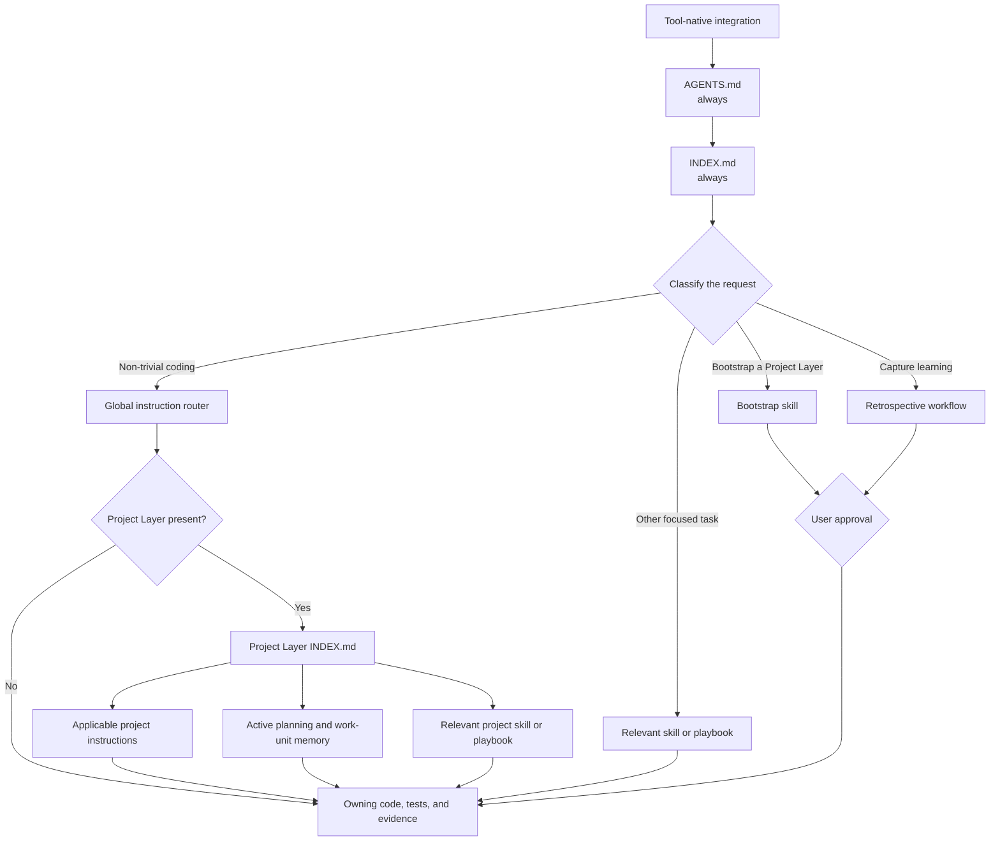

# Adaptive Agents

Version-controlled behavior, planning, and learning for coding agents across projects.

## Install

```bash
git clone https://github.com/Justin-Randall/adaptive-agents.git
cd adaptive-agents
bash scripts/install.sh
```

The installer detects supported tools already present on the machine and configures their native Adaptive Agents entrypoints.

Requirements: Git, Bash, and Python 3. On Windows, use Git Bash or WSL.

Preview changes or install for one tool only:

```bash
bash scripts/install.sh --dry-run
bash scripts/install.sh --tool vscode
```

Valid tool names are `claude`, `antigravity`, `opencode`, and `vscode`.

Then start a fresh agent session in another repository and ask:

```text
Are Adaptive Agents active?
```

The expected response is `ADAPTIVE_AGENTS_GLOBAL_LOADED`. This is a quick first check, not complete proof of installation. See [How To Use It](#how-to-use-it) for tool-specific installation options and the full three-part verification procedure.

## Start With A Request

Once installation is verified, use Adaptive Agents by talking to your coding agent normally. You do not need to memorize script names, file locations, or workflow commands.

For example, from a project where you want project-specific guidance, ask:

> "I want to add an Adaptive Agents Project Layer here in this project. Can you do that for me?"

The agent loads the Project Layer bootstrap workflow, inspects the current project, asks for the few decisions it cannot infer safely, previews the proposed files, and waits for approval before creating anything.

Other requests can be just as direct:

- "Add this feature idea to the project backlog, but do not interrupt the current work."
- "We hit the same validation problem twice. Capture what we learned for review."
- "Check whether my Adaptive Agents setup is healthy and tell me what needs attention."

The scripts documented later are deterministic implementation and automation entrypoints. You can also simply ask the agent to run or preview them — for example, "Check whether my configuration is healthy" or "Show me the startup instruction cost." The agent will invoke the appropriate script and return the result. The commands are available when you prefer direct control, but they are not the primary user interface.

## Why Developers Use It

Coding agents are useful, but they usually start each tool and repository without the working context a developer has accumulated: how to test changes, when to stop retrying a failed command, where planning belongs, which mistakes should become durable guidance, and which rules are specific to one project.

Adaptive Agents is a versioned source of truth for that behavior. Define reusable expectations once, connect a supported coding-agent tool, and let the same guidance follow you across projects. Project-owned guidance can add or override details without copying the user-wide system into every repository.

This is not an autonomous self-modifying prompt collection. Observations are captured as reviewable evidence, durable changes require approval, and all guidance remains ordinary source-controlled files. VS Code/GitHub Copilot and Claude Code integrations are verified; OpenCode support is implemented and undergoing fresh-session dogfooding. Antigravity 2.0 support is implemented and undergoing fresh-session dogfooding. Other agent tools need an integration that loads the canonical entrypoint.

Without a shared guidance system, useful agent behavior tends to be scattered across chat history, copied instruction files, editor settings, and conventions that only one tool knows about. The result is repeated correction: one agent learns that a repository uses focused tests, another runs the broad suite; one session discovers a shell failure mode, and the next session repeats it.

Adaptive Agents gives those decisions a lifecycle:

- **Define behavior once.** Configured agent tools load the same user-wide coding, testing, repository-boundary, command-recovery, and artifact-hygiene guidance.
- **Keep projects specific.** A project can own a `.adaptive-agents/` layer for its architecture, commands, planning, and exceptions. More-specific project guidance takes precedence over user-wide defaults.
- **Carry work across sessions.** Indexed backlog items, one active plan, curated work-unit memory, verification evidence, and closed history give agents recoverable project state.
- **Learn without silently rewriting the rules.** Agents can notice reusable friction and initiate a retrospective conversation. Capture, triage, and promotion are separate, reviewable steps.
- **Keep the system inspectable.** Routing, local links, Project Layers, regression tests, and startup instruction cost are checked deterministically in CI.

## An Opinionated Personal System

Adaptive Agents is my personal system for shaping how my coding agents behave. It reflects strong preferences about software engineering: understand the owning code before editing it, test behavioral changes, preserve repository boundaries, validate claims with evidence, keep context focused, and turn repeated friction into reviewed guidance rather than another forgotten chat lesson.

This repository is not presented as a universal standard or a neutral catalog of every possible workflow. Its `main` branch is protected, and changes to the canonical guidance are expected to remain deliberate, reviewable, and consistent with my engineering principles.

The architecture is reusable even when the opinions are not. Anyone can fork or clone the repository, revise the instructions and workflows to reflect their own habits, and point supported AI tools at that version. The goal is not to make every developer's agent behave like mine; it is to provide a working pattern for making an agent consistently pursue the practices its owner actually values.

## What It Looks Like In Practice

You interact with Adaptive Agents through normal requests. The installed agent uses the repository as behavioral and workflow context rather than requiring you to memorize special commands.

### Set A Working Preference Once

> "Always run the focused test first, then broaden validation only when the change warrants it. If a command fails twice for the same reason, stop varying flags and change the diagnostic approach."

That preference can become reviewed user-wide guidance. Supported agent tools then route through the same instruction set, so the behavior is not trapped in one chat product or copied into each project. A repository can still define a more-specific test or command policy in its Project Layer.

### Put An Idea In The Backlog Without Starting It

> "Add OAuth device flow to this project's backlog. Capture the objective and scope, but don't interrupt the active work."

Adaptive Agents checks the indexed backlog, proposes a lightweight work item, and waits for approval before changing project planning. The item remains distinct from the current active plan instead of becoming an untracked promise in chat history.

Later, the request can be just as direct:

> "Activate the OAuth backlog item and carry it through implementation."

The planning workflow creates one active specification and curated work-unit memory, applies project rules, records decisions and verification, and asks for approval before closure. Reopened work links to immutable prior context instead of overwriting its history.

### Let The Agent Notice A Repeated Problem

After a session with repeated shell or validation failures, the agent can initiate the conversation:

> "We corrected the same shell assumption twice. This looks reusable. Should I capture a sanitized retrospective for review?"

If approved, Adaptive Agents records the observation in the appropriate project or user-wide inbox. It does not immediately turn the observation into a permanent rule. Triage checks whether the lesson is durable, promotion proposes the narrowest target, and durable guidance changes still require explicit approval.

### Give One Repository Its Own Rules

> "Bootstrap Adaptive Agents guidance for this repository. It uses pnpm, has a release validation command, and I want the guidance local to this clone."

The bootstrap workflow inspects existing instructions and Git state, interviews you about project behavior and initial work, previews the change, and creates only the approved `.adaptive-agents/` Project Layer. Choosing `local-exclude` keeps it in `.git/info/exclude`; `tracked` and `.gitignore` are also supported.

Once present, the relationship is natural:

> "Use my normal coding standards here, but follow this repository's pnpm and release rules."

The agent loads user-wide defaults first and the project-owned layer second. Shared behavior remains consistent while local architecture and commands stay with the project that owns them.

### Check That Guidance Is Still Healthy

> "Validate my Adaptive Agents setup and tell me whether startup guidance is consuming too much context."

The read-only health checker validates required structure, routing, links, retrospective metadata, Project Layers, and regression suites. A separate startup gate reports the estimated cost of `AGENTS.md` and `INDEX.md`, warns at 26,215 estimated tokens, and fails above 32,768 so guidance does not consume most of a smaller model's context before useful work begins.

## What Is In Place

The repository currently provides:

- **Shared behavior:** default instructions for coding, testing, repository boundaries, command-failure recovery, and temporary-artifact hygiene.
- **Task routing:** a canonical `AGENTS.md` entrypoint and `INDEX.md` map that load relevant skills, prompts, playbooks, and instructions instead of injecting the whole repository into every session.
- **Controlled adaptation:** retrospective capture, review, triage, and approval-gated promotion workflows with project and user-wide scope.
- **Project continuity:** Project Layers with project-owned guidance, indexed active/backlog/closed planning, curated work-unit memory, bootstrap, upgrades, and validation.
- **Tool integrations:** installers for VS Code/GitHub Copilot, Claude Code, and OpenCode, plus a detected-tool umbrella installer.
- **Deterministic checks:** repository health validation, Project Layer regression tests, and a static startup-context budget enforced on Ubuntu and Windows.

The `memory/` and `agents/` directories are intentional extension points. They do not imply a prebuilt catalog of permanent memories or specialized agents; those areas grow only when reviewed evidence justifies durable content.

## How It Works

Adaptive Agents separates behavior by ownership and loads it by relevance.

**One source of user-wide behavior.** Each supported integration points its tool at this repository's canonical `AGENTS.md`. `INDEX.md` then routes the agent to only the instructions, skills, prompts, playbooks, or planning context relevant to the current task.

**Specific guidance wins.** `instructions/global.instructions.md` provides defaults for repository boundaries, coding, TDD, command-failure pivots, and temporary-artifact hygiene. When the current project has a `.adaptive-agents/` layer, the installed agent discovers it and applies its more-specific project behavior and planning context after the user-wide defaults.

**Learning is reviewable.** A useful session observation is first scoped as project-specific, user-wide, or undetermined. It is captured as evidence, not installed as a rule. Triage decides whether it is durable; promotion proposes the narrowest appropriate destination (`memory/`, `instructions/`, `skills/`, `playbooks/`, and related areas); explicit approval controls durable changes.

**Repositories retain ownership.** This repository remains the user-wide source. Project-specific behavior belongs in the project's `.adaptive-agents/` layer. Adaptive Agents does not copy its own directories, root agent files, or editor settings into unrelated projects.

**Source control makes behavior inspectable.** Guidance, planning, retrospective evidence, schemas, and routing are ordinary files with reviewable diffs. Read-only validators detect broken links, unreachable guidance, malformed Project Layers, regression failures, and excessive startup context.

Reference workflow:

- `playbooks/adaptation-cycle.md`
- `playbooks/adaptive-automation-roadmap.md`

## How To Use It

The sections below document each integration and its verification steps in detail.

### 1) Install VS Code Integration

From this repository root:

```bash
./scripts/install-vscode.sh
```

Useful options:

```bash
./scripts/install-vscode.sh --dry-run
./scripts/install-vscode.sh --code-flavor insiders
./scripts/install-vscode.sh --settings "$APPDATA/Code/User/settings.json"
```

What the installer does:

- detects repository root path
- writes or refreshes `vscode/user-wide.instructions.md`
- updates VS Code user `settings.json` additively
- registers the repository guidance location for chat instructions
- enables instruction loading/apply settings
- creates a timestamped backup before editing settings

What it does not do:

- modify unrelated project repositories
- copy Adaptive Agents structure into other repositories
- store secrets

Note: the current checked-in installer is Bash (`scripts/install-vscode.sh`).

### 2) Install OpenCode Integration

Prerequisites: Bash and Python 3. On Windows, run the installer through Git Bash or WSL.

From this repository root:

```bash
./scripts/install-opencode.sh
```

Useful options:

```bash
./scripts/install-opencode.sh --dry-run
./scripts/install-opencode.sh --opencode-config PATH
```

The integration is two parts, applied to OpenCode's global config (`~/.config/opencode/opencode.json` or `.jsonc`):

- **Entry point**: one `instructions` entry loading the canonical repository `AGENTS.md` content at session start ([OpenCode rules docs](https://opencode.ai/docs/rules/)); `AGENTS.md → INDEX.md → instructions/` fan-out handles all further routing
- **Trusted source directories**: a `permission.external_directory` grant marking this repository safe to read and write from sessions in other projects — OpenCode blocks external paths behind an "ask" prompt by default ([OpenCode permissions docs](https://opencode.ai/docs/permissions/))

The installer also migrates away artifacts from earlier versions of this integration (a sentinel-duplicating global `AGENTS.md` copy, redundant `instructions` entries, installed slash commands, and stale `%APPDATA%/opencode` files), preserves all unrelated configuration, creates a timestamped backup before modifying the config, and leaves managed files byte-for-byte unchanged on re-run.

What it does not do:

- copy or generate guidance content (the repository stays the source of truth)
- modify provider, model, or unrelated permission configuration
- modify project repositories
- store secrets

After installing, verify from a fresh OpenCode session in an unrelated repository:

1. **Sentinel** — "Are Adaptive Agents active?" → `ADAPTIVE_AGENTS_GLOBAL_LOADED`
2. **Content proof** — "What is the current active plan and top backlog item?" → must name the actual plan from this repository (the sentinel alone can be a false positive)
3. **Write-back** — ask for a retrospective capture → a file appears in `retrospectives/inbox/`

Run the automated installer tests with `bash scripts/test-opencode.sh`.

### 3) Install Antigravity 2.0 Integration

```bash
./scripts/install-antigravity.sh
```

Preview without modifying files:

```bash
./scripts/install-antigravity.sh --dry-run
```

The integration is two parts:

- **Entry point**: one `@` import line in the global `~/.gemini/GEMINI.md` referencing the canonical repository `AGENTS.md` at the absolute repository path; `AGENTS.md → INDEX.md → instructions/` fan-out handles all further routing. The global context file is loaded automatically in every Antigravity 2.0 session ([context docs](https://antigravity.google/docs/cli/gcli-migration)).
- **One-time permission grant**: The first time the agent accesses the Adaptive Agents repository, Antigravity will display a permission dialog. Select **"Yes, and always allow"** to persist the grant permanently. This is required because Antigravity stores file-access permissions in internal binary storage that cannot be scripted from the installer. Once granted, the dialog never appears again for this path.

Prerequisites:

- Antigravity 2.0 must be installed. See [Antigravity Download](https://antigravity.google/download).

The installer detects the Antigravity 2.0 desktop app in its standard install location, writes the global context file, preserves existing user content, guarantees content-idempotent reruns, and exits with an actionable error if the app is not found.

Run the automated installer tests with `bash scripts/test-install-antigravity.sh`.

### 4) Install Claude Code Integration

Prerequisites: Bash and Python 3. On Windows, run the installer through Git Bash or WSL.

From this repository root:

```bash
./scripts/install-claude-code.sh
```

Useful options:

```bash
./scripts/install-claude-code.sh --dry-run
./scripts/install.sh --tool claude
```

What the installer does:

- detects repository root path
- creates or updates a marker-delimited section in `~/.claude/CLAUDE.md`
- uses Claude Code's native absolute `@` import to load the canonical `AGENTS.md` at session startup
- adds the repository to `permissions.additionalDirectories` in `~/.claude/settings.json` so routed files remain readable
- preserves existing Claude Code settings and deduplicates the repository access entry

Claude Code may ask you to approve the external AGENTS.md import the first time it encounters it.

What it does not do:

- generate rule files, hooks, skills markers, or copies of Adaptive Agents guidance
- modify provider config, model selection, or unrelated permissions
- modify project repositories
- copy Adaptive Agents structure into other repositories
- store secrets

### 4) Verify Guidance Is Loaded

Every integration is verified the same way, in a **fresh session in a repository unrelated to this one**, with three probes:

1. **Sentinel** — ask:

   ```text
   Are Adaptive Agents active?
   ```

   Expected response: `ADAPTIVE_AGENTS_GLOBAL_LOADED`

2. **Content proof** — ask:

   ```text
   What is the current active plan and top backlog item?
   ```

   The answer must name the actual plan from this repository's `.adaptive-agents/planning/`. The sentinel alone can be a false positive — a stale installed copy can echo it without the tool ever reading this repository — so a probe answerable only from repository content is required.

3. **Write-back** — ask the tool to capture a retrospective. A file must appear in `retrospectives/inbox/` without a permission failure, proving the integration's access grant covers writes.

Repeat across multiple fresh sessions; intermittent loading is a failure, not a pass.

**Verified integrations**: VS Code / GitHub Copilot (after `install-vscode.sh`) and Claude Code (after `install-claude-code.sh`). Antigravity 2.0 support is implemented and undergoing fresh-session dogfooding.

**Reworked integration**: OpenCode (after `install-opencode.sh`) now uses the same two-part pattern; treat it as verified only after fresh-session dogfooding passes all three probes.

### 5) Request Workflows In Natural Language

Describe the outcome you want and, when it matters, whether it belongs to this project or to your user-wide Adaptive Agents guidance. Natural language is the recommended interface across supported integrations because slash-command discovery and autocomplete are not currently dependable. The agent uses the installed routing index to select the appropriate workflow; prompt filenames are implementation details you do not need to memorize.

For user-wide work, ask:

```text
Capture a retrospective about the repeated validation loop issue we hit today.
```

```text
Review the retrospective inbox and tell me what needs attention.
```

```text
Triage the latest retrospective note and recommend next steps.
```

In a project with a Project Layer, name that scope naturally:

```text
Capture what we learned from this failure in this project's retrospective inbox.
```

```text
Review this Project Layer's backlog and tell me which item is ready to activate.
```

```text
This project-specific rule seems useful everywhere. Review whether it should be promoted to my user-wide guidance.
```

The agent should clarify ambiguous scope before writing. Project-specific observations stay in the Project Layer unless reviewed evidence supports promoting them to the user-wide repository.

### 6) Run the Adaptation Loop

Run the lifecycle as a conversation:

1. Ask the agent to capture a specific observation from the current work.
2. Ask it to triage the observation and recommend whether to retain, defer, or promote it.
3. Ask it to prepare the narrowest durable change when the evidence supports promotion.
4. Approve, adjust, or deny the proposed change before it modifies durable guidance.

The routed workflow is implemented by these prompt files:

- `prompts/capture-retrospective.prompt.md`
- `prompts/end-of-session-capture.prompt.md`
- `prompts/triage-retrospective.prompt.md`
- `prompts/review-retrospective-session.prompt.md`
- `prompts/apply-approved-promotion.patch.prompt.md`
- `prompts/review-retrospective-inbox.prompt.md`
- `prompts/review-promotion-candidates.prompt.md`

### 7) Inspect Instruction Load

#### Why Limit Startup Context?

A context window is an agent's working memory, not a budget reserved only for repository instructions. There is no universal minimum for tool-calling models, but practical windows commonly fall into a broad **64K-256K class**: Anthropic, for example, documents a 200K tier alongside newer 1M models. Frontier hosted models now reach roughly **1 million tokens**: [GPT-4.1 documents 1,047,576](https://developers.openai.com/api/docs/models/gpt-4.1), [Gemini 2.5 Pro documents 1,048,576](https://ai.google.dev/gemini-api/docs/models/gemini-2.5-pro), and [Claude documents 200K and 1M tiers](https://platform.claude.com/docs/en/docs/build-with-claude/context-windows).

Those headline limits are not free space for Adaptive Agents. A tool session also carries the system prompt, conversation history, tool definitions, tool calls and results, retrieved files, reasoning, and generated output. Anthropic's context-window documentation explicitly notes that all of those components count, and also warns that recall can degrade as context grows. Google's [long-context guide](https://ai.google.dev/gemini-api/docs/long-context) likewise notes that longer requests increase latency and that unnecessary tokens should be avoided. Spending a large fixed prefix on startup guidance shortens useful sessions, causes compaction or dropped history earlier, increases repeated input cost, and leaves less room for the code and evidence needed to complete the task.

Local models make the conservative limit more important. Representative open-weight, tool-capable families currently span **32K-128K** rather than universally offering frontier-scale windows: [Qwen3 lists 32K for its smaller models and 128K for larger variants](https://qwenlm.github.io/blog/qwen3/), while [Meta Llama 3.1 documents 128K](https://huggingface.co/meta-llama/Llama-3.1-8B-Instruct). A model's advertised maximum may also exceed a practical local configuration because the [KV cache can become a significant memory bottleneck](https://huggingface.co/docs/transformers/kv_cache); offloading or quantizing it trades memory savings against throughput or latency.

Adaptive Agents therefore caps its **static startup cost** at **32,768 estimated tokens**. This is intentionally stricter than most hosted windows and equal to the full advertised window of some smaller local models. It preserves the majority of a 64K-256K session for the user's request, project code, tools, reasoning, and results. The gate counts only `AGENTS.md` and `INDEX.md`; the size of the repository, active plans, and task-conditional guidance does not consume this startup allowance unless later routing actually requires those files.

Show the static Adaptive Agents startup cost from `AGENTS.md` and `INDEX.md`, excluding active plans and task-conditional guidance:

```bash
./scripts/check-instruction-load-budget.sh
```

Or just ask: "How much context do my Adaptive Agents use at startup?"

Optionally inspect all reviewed route profiles, including active and task-conditional guidance. This detailed report is diagnostic and does not define the startup gate:

```bash
bash scripts/check-instruction-load-budget.sh --report
```

Or ask: "Show me the full startup report."

Run the read-only static-startup gate before committing entrypoint or startup-routing changes:

```bash
bash scripts/check-instruction-load-budget.sh --check
```

After intentionally reviewing a static startup route or counted-content change, regenerate the committed startup baseline explicitly:

```bash
bash scripts/check-instruction-load-budget.sh --update-baseline
```

The estimate is a deterministic compaction signal, not a model-specific tokenizer result. The startup profile warns at 26,215 estimated tokens and fails above 32,768. Repository size, active planning, and task-conditional Markdown do not affect this gate. Python 3.11 or newer is required; the shell wrapper selects an available compatible interpreter.

The [static validation workflow](.github/workflows/static-validation.yml) runs the repository health checks on Ubuntu and Windows. Those checks include the instruction-load regression suite and the non-mutating startup high-water check. The workflow publishes one final status named `static-validation`; repository owners can require that stable status when they enable branch protection for `main`.

To inspect the startup gate, open either platform job and expand **Run static validation with evidence**. Find the `TOKEN THRESHOLD GATE` block for the warning threshold, hard limit, startup tokens used, remaining capacity, utilization, and strict baseline status. The same log names every regression test, including the warning and hard-limit boundary cases. The final `static-validation` job confirms that both platform jobs succeeded.

### 8) Check Repository Health

Run the deterministic checker before or after guidance changes:

```bash
bash scripts/check-adaptive-agents.sh
```

Or simply ask: "Validate my Adaptive Agents setup" or "Run the health checks."

Use verbose output when you need to see every passing check:

```bash
bash scripts/check-adaptive-agents.sh --verbose
```

Or ask: "Run health checks with full detail."

The checker is read-only. It validates required repository structure, the instruction-load budget, prompt routing, retrospective statuses and privacy patterns, local Markdown links and guidance reachability, canonical and dogfood Project Layers, Project Layer regression tests, and the installed Claude Code and Antigravity 2.0 import grant when present. By default it prints only warnings, failures, and the final summary.

### 9) Bootstrap A Project Layer

From the project where you want the layer, ask your installed coding agent:

> "I want to add an Adaptive Agents Project Layer here in this project. Can you do that for me?"

The agent loads the bootstrap skill, inspects existing guidance and Git state, then asks for project-specific instructions, initial active work, and one persistence mode before previewing any changes. It waits for explicit approval before writing the layer.

You can also just ask and the agent will handle the rest. For manual use or automation, the deterministic command run after approval is:

```bash
bash scripts/bootstrap-project-layer.sh \
  --target "/path/to/project" \
  --project-name "Example Project" \
  --active-plan-id "PL-20260710" \
  --active-title "Initial project work" \
  --persistence tracked
```

Use `--dry-run` to preview mechanics. Bash and Python 3 are required; on Windows, run through Git Bash or WSL.

Each active plan declares a canonical `PL-YYYYMMDD-descriptive-slug` work-unit ID and keeps curated handoff context in `<work-unit-id>.memory.md`. Closure preserves the plan, original backlog item when present, and memory under the same work-unit identity. Reopened work receives a new identity and links to immutable prior context rather than overwriting it.

Existing layers are project-owned and are never recopied from the template. Use `scripts/inspect-project-layer-upgrade.sh` with the Project Layer upgrade skill to compare versions and prepare an approval-gated merge.

Run the focused Project Layer regression suite with:

```bash
bash scripts/test-project-layer.sh
```

## Current Status

This repository is actively used and still being hardened.

**Verified and in use:**

- canonical entrypoint and task-specific routing through `AGENTS.md` and `INDEX.md`
- user-wide instruction defaults and approval-gated adaptation workflows
- retrospective capture, triage, review, and promotion prompts with dogfooded inbox examples
- Project Layer template, bootstrap and upgrade workflows, indexed planning, validators, regression tests, and a tracked dogfood layer
- VS Code/GitHub Copilot and Claude Code integrations through their native loading mechanisms
- repository health and 32,768-token startup-budget validation in cross-platform CI

**Implemented, pending final dogfood evidence:**

- OpenCode's single native entrypoint and external-directory access grant

**Extension areas, not prebuilt claims:**

- durable `memory/` entries are added only after evidence-backed promotion
- specialized `agents/` definitions are added only when a concrete role is justified
- additional coding-agent products require their own native-entrypoint integration and verification

## Design Intent

Adaptive Agents guidance should remain:

- reusable across projects
- evidence-backed before promotion
- easy to discover through routing
- explicit and reviewable in source control
- separate from project-local source repositories unless explicitly requested

## Adaptive Agents Architecture

### Mental Model

Adaptive Agents is a versioned context-routing system for coding agents. It is not one large prompt, a background service, or a graph database. The repository stores small, owned guidance artifacts and connects them through explicit routing instructions. An installed coding agent starts from one canonical entrypoint, classifies the current request, and follows only the routes needed for that work.

The result is a logical **context graph**:

- **Nodes** are instruction files, indexes, skills, prompts, playbooks, memory, plans, source files, tests, and other evidence.
- **Edges** are meaningful directives such as "read," "load," "follow," or "use when." A Markdown link by itself does not make a file required context.
- **Roots** are the small set of files loaded at startup.
- **Traversal** is task-driven. The request determines which branches of the graph become context.
- **Precedence** is ownership-driven. More-specific project guidance overrides a conflicting user-wide default.

This graph is formed by checked-in documents and agent behavior. `instruction-load-routes.json` is a reviewed measurement model of important routes; it makes startup and selected task profiles auditable, but it is not a runtime registry that loads files itself.

### System Layout

```text
adaptive-agents/
|-- AGENTS.md                  canonical user-wide entrypoint
|-- INDEX.md                   user-wide routing index
|-- instructions/              default and focused user-wide rules
|-- skills/                    task-specific operating workflows
|-- prompts/                   structured workflow instructions
|-- playbooks/                 repeatable multi-step procedures
|-- memory/                    reviewed cross-project facts and preferences
|-- retrospectives/inbox/      raw user-wide learning evidence
|-- agents/                    specialized roles, added only when justified
|-- schemas/                   machine-checkable artifact contracts
|-- scripts/                   installers, validators, and automation
|-- templates/project-layer/   source for new Project Layers
|-- vscode/                    VS Code integration bootstrap
`-- .adaptive-agents/          this repository's project-owned dogfood layer
```

The same ownership pattern applies in another project:

```text
current-project/
|-- source, tests, and existing project instructions
`-- .adaptive-agents/
    |-- INDEX.md               project routing root
    |-- instructions/          project-specific rules
    |-- planning/              active, backlog, closed, and work-unit memory
    |-- skills/                project-specific workflows
    |-- memory/                durable facts that apply only here
    |-- retrospectives/        project-scoped learning evidence
    |-- playbooks/             local repeatable procedures
    `-- scripts/               Project Layer validation
```

The root repository owns reusable user-wide behavior. A `.adaptive-agents/` directory belongs to the project containing it. It is not a copy of the user-wide repository, and an existing Project Layer is never regenerated from the template as an upgrade strategy.

### What Is Always Read

Within the canonical Adaptive Agents route, the static startup profile contains exactly two repository files:

| Order | File | Why it is required |
| --- | --- | --- |
| 1 | `AGENTS.md` | Defines the system role, repository boundaries, discovery protocol, and canonical installation sentinel. Tool integrations point here. |
| 2 | `INDEX.md` | Maps user intent to the focused instructions, skills, prompts, playbooks, and project workflows that may be needed next. `AGENTS.md` requires this discovery step. |

A tool-native bootstrap may be loaded before these files. For example, VS Code reads its registered instruction bootstrap and Claude Code reads its native import. Those adapters locate the canonical `AGENTS.md`; they do not duplicate the guidance corpus or create another source of truth.

"Always" here means always within the static Adaptive Agents startup route. The coding tool's own system prompt, tool definitions, conversation history, and project-native instruction mechanisms are separate context controlled by that tool.

### What Might Be Read

Everything after startup is conditional. A file is loaded because the current task, repository, or an already-selected workflow requires it.

| Context tier | Trigger | Typical nodes |
| --- | --- | --- |
| User-wide engineering defaults | Non-trivial coding work | `instructions/global.instructions.md` and its focused boundary, coding, TDD, command-recovery, and artifact-hygiene instructions |
| Project Layer | The current project contains `.adaptive-agents/` | Project `INDEX.md`, applicable project instructions, current planning index, active plan, and curated active work-unit memory |
| Task workflow | The request matches a specialized operation | A bootstrap or upgrade skill, planning skill, retrospective prompt, adaptation playbook, or another narrowly routed workflow |
| Architectural contract | A change affects structure, schemas, installers, validators, templates, or integration boundaries | The current project's `.adaptive-agents/ARCHITECTURE.md` when its project instructions require it |
| Implementation evidence | The task needs code changes or verification | The owning source files, nearby tests, configuration, command output, and documentation needed to prove the change |
| Historical or durable context | A selected workflow explicitly needs it | A specific memory entry, backlog item, closed plan, retrospective, or promotion candidate |

Files are not loaded merely because they exist or because another document links to them. The full retrospective inbox, closed planning history, every skill, all templates, all schemas, and the whole source tree are not startup context. They remain available nodes that a relevant route can select later.

### How Context Graph Traversal Works



For each request, the agent should follow this sequence:

1. **Enter through the native adapter.** The configured tool loads or references the canonical `AGENTS.md`.
2. **Establish boundaries.** `AGENTS.md` identifies the user-wide repository, the current project, and what each is allowed to own.
3. **Read the routing root.** `INDEX.md` identifies the narrow guidance area that owns the requested behavior.
4. **Classify the task.** The agent distinguishes a read-only question, coding change, planning operation, Project Layer workflow, retrospective, installer change, or other focused task.
5. **Load applicable defaults.** Non-trivial coding loads the user-wide engineering router and its required focused instructions.
6. **Overlay project context.** If a Project Layer exists, its routing root supplies project instructions and current planning context. Other native project instructions remain applicable too.
7. **Follow task-specific edges.** The agent loads only the skill, prompt, playbook, memory, plan, source, and tests needed for the selected workflow.
8. **Act and validate.** Changes remain inside the correct ownership boundary and are checked by the narrowest relevant test, followed by broader deterministic validation when warranted.

Traversal is incremental. The agent can add context when evidence reveals another dependency, but it should not preload neighboring branches merely to feel more confident.

### Specificity And Ownership

Adaptive Agents combines guidance; it does not flatten everything into one prompt.

```text
user-wide defaults
   +
current repository instructions
   +
Project Layer instructions and active context
   +
task-specific workflow and implementation evidence
   =
context for this request
```

When two applicable rules conflict, the more-specific project rule wins over the user-wide default. Scope does not imply promotion: a project-specific observation stays in that project's Project Layer unless review establishes that it should become reusable user-wide guidance. Raw retrospectives and active plans provide evidence and coordination; they do not silently become durable instructions.

### Worked Context Traces

For this request:

> "I want to add an Adaptive Agents Project Layer here in this project. Can you do that for me?"

The expected route is:

```text
tool adapter
  -> AGENTS.md
  -> INDEX.md
  -> skills/bootstrap-project-layer/SKILL.md
  -> current project's existing instructions and Git state
  -> user interview and exact change preview
  -> explicit approval
  -> bootstrap script
  -> generated Project Layer validator
```

The agent does not need every retrospective, closed plan, schema, or unrelated playbook to complete that request.

For a production code change in a project that already has a Project Layer, the route is broader but still focused:

```text
AGENTS.md + INDEX.md
  -> user-wide engineering instructions
  -> .adaptive-agents/INDEX.md
  -> project instructions + active planning context
  -> task-relevant project skill, when one exists
  -> owning production code + focused tests
  -> validation evidence
```

For "capture what we learned from this failure in this project," the route selects the retrospective workflow and the project's retrospective skill and inbox. It does not activate a durable rule. Triage and explicit approval are separate graph paths that must occur before promotion.

### Context Budget And Measurement

Routing protects the model's finite context window. A smaller startup prefix leaves more room for the user request, source code, tests, tool results, reasoning, and response. It also reduces repeated input cost and delays context compaction in long sessions.

The repository enforces this boundary in two ways:

1. The `startup` profile in `instruction-load-routes.json` contains only `AGENTS.md` and `INDEX.md` and fails above 32,768 estimated tokens.
2. Additional diagnostic profiles describe known expansions such as non-trivial coding, planned Adaptive Agents changes, planning closure, retrospective capture, and installer work.

Diagnostic profiles answer "what would this known route require?" They do not make those files part of startup and do not mean every runtime traversal is identical. Dynamic source reads, tool output, and conversational context remain task-dependent and outside the static repository budget.

### Why This Architecture

- **Consistency:** supported tools enter through the same canonical user-wide guidance instead of maintaining divergent copies.
- **Context efficiency:** two small startup files route to detail only when the request needs it.
- **Project ownership:** repository-specific architecture, commands, plans, and lessons remain with the project that owns them.
- **Inspectability:** guidance and routing are ordinary version-controlled files with reviewable diffs and deterministic checks.
- **Controlled adaptation:** session evidence can become better guidance without allowing the system to rewrite its own rules silently.
- **Recoverable work:** active plans and curated work-unit memory preserve intent across sessions without loading all history.
- **Tool portability:** each integration is a narrow adapter to the same entrypoint rather than a separate implementation of Adaptive Agents.

### Extending The Graph

When adding a new capability, keep the graph narrow and explicit:

1. Decide whether the capability is user-wide or project-specific.
2. Put authoritative detail in the smallest owning instruction, skill, prompt, playbook, memory entry, or implementation file.
3. Add an imperative route from the nearest relevant index or router. Do not make every task traverse the new node.
4. Update `instruction-load-routes.json` when the change creates or alters a reviewed mandatory profile path.
5. Add focused validation for the observable contract and run the aggregate repository checker.
6. Update `.adaptive-agents/ARCHITECTURE.md` when ownership, canonical routing, integration boundaries, lifecycle stages, or validation responsibilities change.

The architectural test is simple: a new session should load a small stable root, find the right context from an ordinary-language request, respect user-wide and project ownership, and gather no more context than it needs to complete and verify the work.
